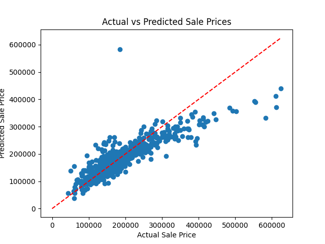

# House Pricing Prediction Model

This model uses a linear regression algorithm to predict the sale price of houses based on their features. It takes in a CSV file containing housing data and outputs a prediction for each house in the test set.

## Installation

To install the required dependencies, run the following command:
pip install -r requirements.txt

## Usage

To run the model, simply execute the `house-pricing-prediction.py` script: python house-pricing-prediction.py

This will train the model on the training set, make predictions on the test set, and output the R-squared score of the model.

## Data

The housing data used in this model was taken from the Ames Housing dataset, which can be found [here](https://www.kaggle.com/datasets/prevek18/ames-housing-dataset?select=AmesHousing.csv).

## Results
The linear regression model achieved an R^2 score of 0.74 on the test set. This suggests that the model is a reasonably good fit for the data.

To visualize the performance of this model, we can plot the predicted sale prices against the true sale prices in the test set: Predicted vs. true sale prices

As we can see, there is a reasonably strong linear relationship between the predicted and true sale prices, indicating that this model is able to capture the underlying patterns in the data.
However, there are also some clear outliers that the model struggles to predict accurately, suggesting that there may be some unobserved factors influencing house prices that the model does not account for.
